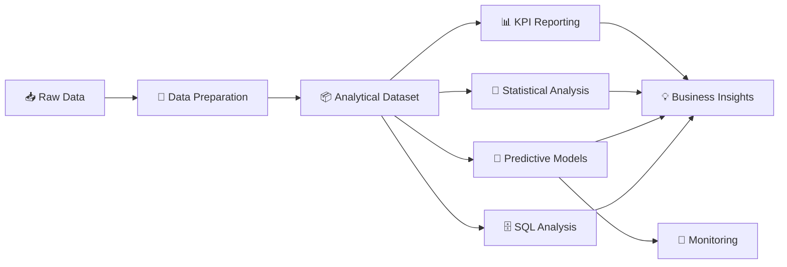
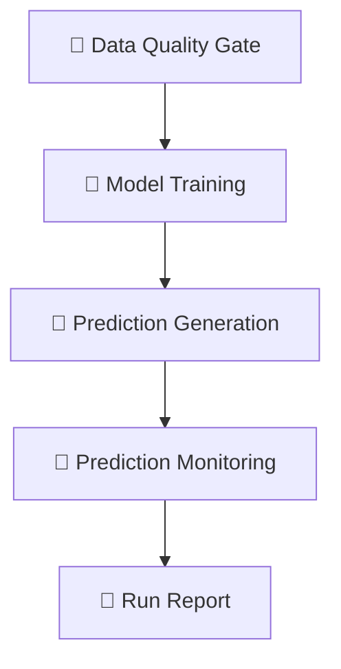

<div align="center">

# 🏃‍♂️ Strava Fitness Analytics App

### From raw fitness data to trusted metrics, predictive signals, and business decisions


**An end-to-end Data Analytics & Business Analytics portfolio project**
combining data preparation, KPI reporting, statistics, predictive modeling, SQL analytics, data-quality controls, and business insights in one Streamlit application.

</div>

---

## 📑 Table of Contents

- [📌 Executive Summary](#-executive-summary)
- [🎯 Business Problem & Objectives](#-business-problem--objectives)
- [🖥️ Application Pages](#️-application-pages)
- [❓ Key Analytical Questions](#-key-analytical-questions)
- [🔄 Analytics Workflow](#-analytics-workflow)
- [🧹 Data Quality](#-data-quality)
- [🤖 Predictive Analytics](#-predictive-analytics)
- [📡 Prediction Monitoring](#-prediction-monitoring)
- [⚙️ Production-Style Pipeline](#️-production-style-pipeline)
- [🗄️ SQL Analytics Playground](#️-sql-analytics-playground)
- [💡 Business Insights](#-business-insights)
- [🗂️ Project Architecture](#️-project-architecture)
- [🧰 Technology Stack](#-technology-stack)
- [🚀 Getting Started](#-getting-started)
- [🔁 Reproducing the Pipeline](#-reproducing-the-pipeline)
- [🏛️ Analytical Governance](#️-analytical-governance)
- [⚠️ Limitations](#️-limitations)
- [🏆 What This Project Demonstrates](#-what-this-project-demonstrates)
- [🎤 Portfolio Talking Points](#-portfolio-talking-points)
- [📄 License](#-license)

---

## 📌 Executive Summary

Fitness activity data is usually fragmented across **daily, hourly, and minute-level** records. A business-ready analytics solution needs more than charts: it needs a consistent data model, defined KPIs, quality checks, reproducible workflows, and a clear path from findings to decisions.

This project delivers that through a structured analytics pipeline:



The Streamlit app gives stakeholders an interactive space to explore participant behavior, activity patterns, calorie expenditure, sleep and wellness indicators, predictive outputs, and business questions.

> 🎯 **Purpose:** demonstrate how a Data Analyst / Business Analyst moves from raw operational data to trusted metrics, predictive signals, and business-oriented recommendations.

---

## 🎯 Business Problem & Objectives

### 🧩 The Problem

A fitness analytics business wants to understand:

- How active are participants over time?
- What drives differences in daily activity and calorie expenditure?
- Which participants or behavioral patterns need attention?
- How are sleep and wellness related to activity?
- Can historical activity support next-day predictions?
- Which findings matter for product, engagement, wellness, or customer-success decisions?

The data must be **consistent** across source tables, **validated** before analysis, **explorable** by non-technical stakeholders, **reproducible** through code, and **tied** to measurable business questions.

### ✅ Objectives

| # | Objective | Description |
|---|-----------|-------------|
| 1 | 📏 **Measure Performance** | Track activity, steps, distance, intensity, calories, sleep, and related KPIs |
| 2 | 🧠 **Understand Behavior** | Identify participant-level and time-based patterns |
| 3 | 🔗 **Detect Relationships** | Use statistics to test relationships between operational and behavioral variables |
| 4 | 🔮 **Predict Outcomes** | Generate predictive signals for calories, activity-target, and sleep-target attainment |
| 5 | 🧭 **Support Decisions** | Translate findings into business-oriented insights, not just visuals |

---

## 🖥️ Application Pages

| Page | Business Purpose |
|------|------------------|
| 🏠 **Executive Overview** | High-level KPI summary and overall fitness performance |
| 🔥 **Activity and Calories** | Steps, distance, intensity, activity patterns, and calories |
| 😴 **Sleep and Wellness** | Sleep behavior and wellness indicators |
| 👥 **Participant Analysis** | Participant-level performance and behavior comparison |
| 📐 **Statistical Analysis** | Distributions, relationships, and statistical patterns |
| 🤖 **Predictive Insights** | Model outputs, performance, and prediction monitoring |
| 🗄️ **SQL Playground** | Controlled, read-only SQL for business questions |
| 💡 **Business Insights** | Stakeholder-ready findings and decision support |

<!-- 📸 Add screenshots here, e.g.:

-->

---

## ❓ Key Analytical Questions

<details>
<summary><b>🏃 Engagement & Activity</b></summary>

- How active are participants across the observed period?
- What does daily activity look like over time?
- Which activity levels are most common?
- How do steps, distance, and intensity vary between participants?

</details>

<details>
<summary><b>🔥 Calories</b></summary>

- How does calorie expenditure vary by activity behavior?
- Which variables are associated with higher or lower calorie expenditure?
- Are there meaningful differences between participant groups?

</details>

<details>
<summary><b>😴 Sleep & Wellness</b></summary>

- How often do participants achieve the defined sleep target?
- How does sleep behavior vary across participants?
- Are there observable relationships between sleep and activity?

</details>

<details>
<summary><b>👥 Participant Performance</b></summary>

- Which participants show consistently high activity?
- Which show lower or inconsistent engagement?
- How stable are individual activity patterns?

</details>

<details>
<summary><b>🔮 Predictive Analytics</b></summary>

- Can historical activity signals estimate next-day calories?
- Can previous behavior classify whether a participant will meet an activity target?
- Can historical sleep information classify sleep-target attainment?

</details>

<details>
<summary><b>💼 Business Analysis</b></summary>

- Which findings are most relevant to engagement and wellness use cases?
- Where could monitoring or targeted interventions be considered?
- Which metrics should stakeholders keep tracking?

</details>

---

## 🔄 Analytics Workflow

### 1️⃣ Data Preparation 🧹

Multiple raw datasets at different granularities are consolidated into one analytical dataset:

| Granularity | Sources |
|-------------|---------|
| 📅 **Daily** | activity, calories, intensities, steps, sleep-day records |
| 🕐 **Hourly** | calories, intensities, steps |
| ⏱️ **Minute-level** | calories, intensities, METs, sleep, steps |
| ❤️ **Other** | heart-rate observations, weight-log records |

The cleaning notebook (`notebooks/01_Fitness_Data_Cleaning_and_Merging.ipynb`) produces the canonical dataset and its metadata:

```text
data/processed/fitness_daily_master.csv       # canonical daily analytical dataset
data/processed/fitness_data_dictionary.csv    # column definitions & metadata
```

---

## 🧹 Data Quality

A production-style workflow validates data **before** modeling and reporting. A reusable gate checks the analytical dataset before model training and prediction generation:

```text
scripts/run_data_quality_gate.py
```

| Status | Meaning |
|--------|---------|
| ✅ **PASS** | Validation completed successfully |
| ⚠️ **WARN** | Known limitation or missingness pattern, handled by the pipeline |
| ❌ **FAIL** | Condition that prevents reliable downstream processing |

### 🔍 Key Data Quality Consideration

Sleep-related fields contain **substantial missingness**. Instead of treating missing sleep as a positive or negative outcome, the target logic was repaired so unavailable observations **remain missing** and are handled explicitly by the predictive workflow.

> 💬 **Principle:** Missing data should not automatically be interpreted as negative behavior.

Quality and pipeline outputs are written to `data/quality/` (generated artifacts, not core dashboard inputs).

---

## 🤖 Predictive Analytics

A reproducible pipeline models three business-relevant targets:

| 🎯 Target | 🧮 Problem Type | 💼 Business Meaning |
|-----------|----------------|---------------------|
| 🔥 **Calories** | Regression | Estimate next-day calorie expenditure |
| 🏅 **Activity Target** | Classification | Predict whether a participant will meet the activity target |
| 😴 **Sleep Target** | Classification | Predict whether a participant will meet the sleep target |

Features use **lag-based historical activity** plus calendar variables, built only from information available **before** the prediction date to reduce target leakage.

### 🛠️ Model Development Steps

1. Feature preparation
2. Chronological train / holdout / backtest split
3. Model training
4. Model comparison
5. Evaluation
6. Prediction generation
7. Monitoring
8. Model artifact storage

Main script: `scripts/train_predictive_model.py`

### 📈 Holdout Results (latest validated run)

| Model | Metric | Result |
|-------|--------|-------:|
| 🔥 Calories Regression | MAE | 469.21 |
| 🔥 Calories Regression | RMSE | 725.36 |
| 🔥 Calories Regression | R² | 0.296 |
| 🏅 Activity Target | Accuracy | 0.799 |
| 🏅 Activity Target | Precision | 0.590 |
| 🏅 Activity Target | Recall | 0.857 |
| 🏅 Activity Target | F1 | 0.699 |
| 🏅 Activity Target | ROC-AUC | 0.908 |
| 😴 Sleep Target | Accuracy | 0.667 |
| 😴 Sleep Target | Precision | 0.717 |
| 😴 Sleep Target | Recall | 0.767 |
| 😴 Sleep Target | F1 | 0.742 |
| 😴 Sleep Target | ROC-AUC | 0.688 |

For calories, a **linear-regression baseline** was also compared, showing that model selection is driven by measured performance rather than assuming complexity is better.

> ⚠️ These are descriptive results on the historical dataset used here. They are **not** evidence of production performance on a new population.

### 🧾 Prediction Generation

```text
scripts/run_predictive_predictions.py  →  data/processed/predictions.csv
```

The output feeds the **Predictive Insights** page.

---

## 📡 Prediction Monitoring

```text
scripts/run_predictive_monitoring.py
```

Monitoring compares predictions against available actual outcomes and records model-review signals:

- 🔁 Prediction vs. actual outcome
- 🏷️ Prediction status
- 📏 Historical-range checks
- 🌊 Feature-drift indicators
- 🚩 Review-required conditions

This creates a realistic **model monitoring loop** instead of treating training as a one-time task.

---

## ⚙️ Production-Style Pipeline

A single orchestrator runs the full workflow:



```bash
python scripts/run_production_pipeline.py
```

Run-level status and audit information are written to `data/quality/`, so validation, modeling, and monitoring are connected rather than run as unrelated notebook steps.

---

## 🗄️ SQL Analytics Playground

`pages/7_SQL_Playground.py` lets users answer business questions with **controlled, read-only SQL**.

### 🔒 Safeguards

| Control | Description |
|---------|-------------|
| 🚦 Query type | `SELECT` / `WITH` only |
| 1️⃣ Statement limit | Single statement per execution |
| 📏 Size limits | Result-size and query-length caps |
| ⏱️ Timeout | Execution timeout |
| 🛡️ Access mode | SQLite read-only |
| 🚫 Blocking | Write and schema operations blocked |
| 📝 Auditing | Queries logged to `data/quality/sql_query_audit_log.csv` |

### 💼 Predefined Business Questions

Covers participant activity, performance comparison, productive activity behavior, rankings, trends, target attainment, and participant segmentation. Users can inspect the SQL before running it.

> 🔁 **Workflow:** Business Question → Metric Definition → SQL Logic → Result → Interpretation

---

## 💡 Business Insights

The final layer turns analysis into stakeholder-ready observations:

| Theme | Focus |
|-------|-------|
| 📊 **Performance** | What the data shows about overall participant activity and behavior |
| 🤝 **Engagement** | Where participation or consistency differs |
| 🌙 **Wellness** | How sleep and activity measures behave in the historical records |
| 🔮 **Predictive Signals** | Where model outputs may help prioritize attention or monitoring |
| 🧭 **Decision Support** | What stakeholders could monitor, investigate, or feed into future analysis |

The aim is not to prescribe actions automatically, but to show how analytical evidence supports business decisions.

---

## 🗂️ Project Architecture

```text
Strava Fitness App Project/
│
├── 🏠 Home.py
├── 📘 README.md
├── 📦 requirements.txt
├── 🙈 .gitignore
│
├── 📁 data/
│   ├── processed/
│   │   ├── fitness_daily_master.csv
│   │   ├── fitness_data_dictionary.csv
│   │   └── predictions.csv
│   ├── quality/
│   │   ├── data_quality_report.json
│   │   ├── production_pipeline_latest.json
│   │   ├── production_pipeline_history.jsonl
│   │   └── sql_query_audit_log.csv
│   └── raw / merged source datasets
│
├── 🖼️ images/
│   └── strava_logo.png
│
├── 🤖 models/
│   └── predictive_models/
│       ├── activity_target/
│       ├── calories/
│       ├── sleep_target/
│       └── monitoring_log.csv
│
├── 📓 notebooks/
│   └── 01_Fitness_Data_Cleaning_and_Merging.ipynb
│
├── 📄 pages/
│   ├── 1_Executive_Overview.py
│   ├── 2_Activity_and_Calories.py
│   ├── 3_Sleep_and_Wellness.py
│   ├── 4_Participant_Analysis.py
│   ├── 5_Statistical_Analysis.py
│   ├── 6_Predictive_Insights.py
│   ├── 7_SQL_Playground.py
│   └── 8_Business_Insights.py
│
├── ⚙️ scripts/
│   ├── run_data_quality_gate.py
│   ├── run_predictive_monitoring.py
│   ├── run_predictive_predictions.py
│   ├── run_production_pipeline.py
│   └── train_predictive_model.py
│
└── 🧰 utils/
    ├── __init__.py
    ├── data.py
    ├── data_quality.py
    ├── predictive_model.py
    ├── predictive_registry.py
    ├── sql.py
    └── theme.py
```

### 🧱 Data Layers

| Layer | Location | Role |
|-------|----------|------|
| 📥 **Source** | raw / merged datasets | Preserves original granularity |
| 📦 **Analytical** | `fitness_daily_master.csv` | Central daily dataset for reporting and modeling |
| 🔮 **Prediction** | `predictions.csv` | Prediction outputs consumed by the app |
| 🤖 **Model** | `models/predictive_models/` | Trained artifacts and metadata |
| 📡 **Monitoring** | `data/quality/` | Data-quality, pipeline, and SQL audit outputs |

---

## 🧰 Technology Stack

| Area | Technologies |
|------|--------------|
| 🖥️ Application | Python, Streamlit |
| 🐼 Data Analysis | Pandas, NumPy |
| 📊 Visualization | Plotly, Matplotlib |
| 📐 Statistics | Python statistical tooling |
| 🤖 Machine Learning | scikit-learn |
| 🗄️ SQL | SQL, SQLite |
| 💾 Model Persistence | Joblib |
| 🛠️ Development | VS Code, Git, GitHub |
| 📝 Documentation | Markdown |

---

## 🚀 Getting Started

**1️⃣ Clone the repository**

```bash
git clone <your-github-repository-url>
cd <repository-folder>
```

**2️⃣ Create a virtual environment**

```bash
# Windows
python -m venv .venv
.venv\Scripts\activate

# macOS / Linux
python -m venv .venv
source .venv/bin/activate
```

**3️⃣ Install dependencies**

```bash
pip install -r requirements.txt
```

**4️⃣ Run the app**

```bash
streamlit run Home.py
```

The application opens in your browser. 🎉

---

## 🔁 Reproducing the Pipeline

The app works directly from the prepared analytical data. For a full model refresh:

```bash
python scripts/run_production_pipeline.py
```

Or run each stage independently:

```bash
python scripts/run_data_quality_gate.py
python scripts/train_predictive_model.py
python scripts/run_predictive_predictions.py
python scripts/run_predictive_monitoring.py --model all
```

Each stage is independently auditable.

---

## 🏛️ Analytical Governance

| Practice | How it is applied |
|----------|-------------------|
| 🔁 **Reproducibility** | Core transformations and model workflows live in Python scripts, not only notebooks |
| 📏 **Metric Consistency** | One canonical dataset keeps dashboards, SQL, and model features aligned |
| ✅ **Data Validation** | A dedicated quality gate runs before the predictive pipeline |
| 🚫 **Leakage Prevention** | Features use only information available before the prediction date |
| 📡 **Monitoring** | Predictions are evaluated after generation |
| 🔒 **Controlled SQL** | Read-only, audited analytical access |

---

## ⚠️ Limitations

- 🗓️ **Historical data only** — not a continuously updating production stream
- 🔐 **No authentication** — no user-account system implemented
- 🔌 **No live ingestion** — no production pipeline from a fitness platform API
- 👥 **Limited population** — model performance depends on the participants and period represented
- 🔮 **Predictions are decision support** — analytical signals, not guaranteed outcomes
- 🕳️ **Missing data** — sleep-related fields have missing observations; the workflow handles missingness explicitly rather than assuming a behavioral outcome

---

## 🏆 What This Project Demonstrates

### 📊 Data Analyst Skills

- Data cleaning and preparation
- Exploratory data analysis
- KPI design and dashboard development
- Statistical analysis
- SQL analytics
- Predictive modeling and evaluation
- Data-quality validation
- Reproducible analytical workflows
- Analytical storytelling

### 💼 Business Analyst Skills

- Converting business questions into measurable metrics
- Stakeholder-oriented dashboard design
- Structured problem solving
- Performance analysis, segmentation, and comparison
- Identifying meaningful trends
- Translating quantitative findings into business insights
- Supporting evidence-based decisions
- Communicating limitations and uncertainty

### ⭐ Portfolio Highlights

| Highlight | Description |
|-----------|-------------|
| 🔗 **End-to-End Analytics** | Raw datasets to business-facing outputs |
| 🎯 **Stakeholder Reporting** | Built around business questions, not just technical demos |
| 🤖 **Predictive Analytics** | Regression and classification on historical behavioral data |
| 🗄️ **SQL Business Analysis** | Practical SQL tied to business questions |
| 🛡️ **Quality & Monitoring** | Validation, pipeline status, prediction monitoring, SQL auditing |
| 🔁 **Reproducibility** | Main workflows executable via scripts |

---

## 🎤 Portfolio Talking Points

> *Built an end-to-end fitness analytics application in Python and Streamlit that transformed multi-granular activity data into KPI dashboards, statistical analysis, business-oriented SQL insights, and predictive models for calorie expenditure, activity-target attainment, and sleep-target attainment. Implemented a data-quality gate, reproducible model pipeline, prediction monitoring, and controlled SQL execution to make the workflow closer to a real-world analytics solution.*

**Project outcome:** `Data → Metrics → Insights → Predictions → Monitoring` in a single decision-support workflow.

---

<div align="center">

⭐ If you found this project useful, consider giving it a star!

**Built with 🐍 Python · 📊 Streamlit · 🤖 scikit-learn**

</div>
